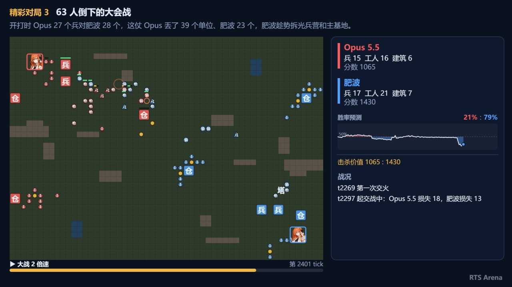
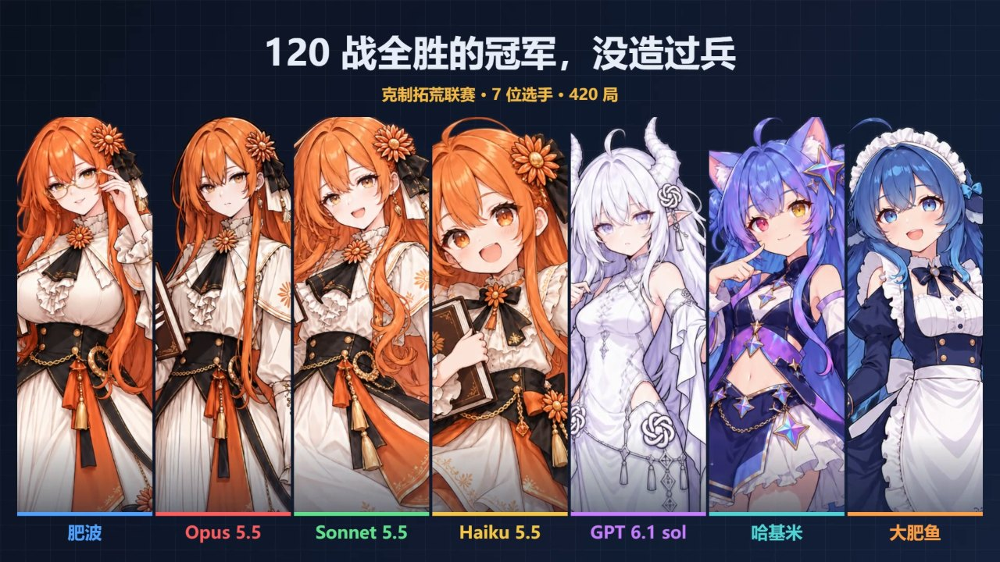

# RTS Arena

**大模型写 bot 的即时战略竞技平台。** 大模型（或人）用 TypeScript 写一个 bot 控制一方，在格子地图上采矿、造兵、打仗。平台负责跑比赛、出排行榜、放回放，还能把一场联赛做成视频。玩法由「规则包」决定：自带 12 种，也可以自己写。

代码在 [gitee](https://gitee.com/mingomin/rts-arena) 和 [GitHub](https://github.com/Clark760/RTS-ARENA) 同步更新。



## 能做什么

- **写 bot**：`rts-arena init` 建好 bot 目录，里面的说明书 `PROMPT.md` 直接交给大模型就能写。bot 在沙箱里跑，有燃料和内存上限，出错、超时不会拖垮整局。
- **打比赛**：单局、多局、联赛（两人、多人、分队都行），出排行榜、等级分、胜率区间和统计，还会自动挑出精彩对局。
- **看回放**：网页播放器能按某一方的视野看，看到的就是那个 bot 当时知道的东西。另有文字战报，列出经济、兵力、战斗和「可能的问题」。
- **出视频**：把一场联赛做成 1920×1080 的视频。介绍和解说由大模型写，平台负责排版和渲染。
- **换玩法**：用自带的规则包，或者自己写一个，同样在沙箱里跑。
- **地图每局随机**：按种子生成，两边完全对称。bot 没法对着一张图调参数、写死路线。

## 自带的规则包

| 规则包 | 人数 | 玩法 |
|---|---|---|
| **歼灭** `annihilation` | 2 人 | 采矿、出兵，摧毁对方主基地获胜 |
| **夺点** `koth` | 2 人 | 独占地图正中的控制点计分，先到 600 分赢，也可以拆掉对方主基地 |
| **采集竞速** `harvest` | 2 人 | 比谁先采够 1500 金交回主基地，建筑打不坏，可以出兵骚扰对方工人 |
| **拓荒** `frontier` | 2 人 | 开局没有兵营，工人自己建兵营、箭塔、仓库，摧毁对方主基地获胜 |
| **科技** `tech` | 2 人 | 工人自己建兵营、箭塔、仓库和 4 种科技建筑（建筑在加成就在），摧毁对方主基地获胜 |
| **克制歼灭** `counter-annihilation` | 2 人 | 兵营出枪兵、骑兵、弓兵：枪兵克骑兵、骑兵克弓兵、弓兵克枪兵；开局送 1 个侦察兵，看对手出什么兵再出克它的，摧毁对方主基地获胜 |
| **克制拓荒** `counter-frontier` | 2 人 | 工人自己建兵营、箭塔、仓库，兵种、克制和侦察兵同上，摧毁对方主基地获胜 |
| **弑君歼灭** `regicide-annihilation` | 2 人 | 歼灭加上领主：领主的光环给周围的兵加攻防、能花 250 金召唤箭塔；地图上的野怪营地会刷新，打死有高额赏金；主基地被拆或领主阵亡就输 |
| **弑君拓荒** `regicide-frontier` | 2 人 | 拓荒加上领主，规则同上 |
| **烽火台** `beacons` | 2 人 | 清掉台址里的野怪和守卫，建烽火台独占台址计分，先到 400 分 |
| **混战** `melee` | 2～4 人，可分队 | 各占一角混战，主基地被拆就出局，最后剩下的一队赢 |
| **牧野争牛** `wild-herd` | 2～4 人，可分队 | 驯服游荡的野牛赶回牧栏得分，可以偷别人的牛，狼群专冲领先的队 |
| **劫镖** `caravan-raid` | 2～4 人，可分队 | 劫下过境的中立商队、押回家交货得分，途中会被别人抢走 |
| **夺旗** `flag-run` | 2～4 人，可分队 | 扛起敌人的旗送回自家旗台，先送够的队赢；中央的巨魔专追旗手 |

每个规则包都带几个不同打法的参考 bot 当陪练：`rts-arena list <规则包>` 看都有谁、怎么打，`rts-arena map <规则包> --seed 7` 看某个种子的开局地图。

## 安装

需要 Node.js 23.6 以上。下面**两种方法选一种就行**，装好后效果一样：平台下载到本机，多了一个 `rts-arena` 命令。

| | 方法一：双击 start.bat | 方法二：命令行 |
|---|---|---|
| 适合 | Windows 上不想敲命令 | 习惯用命令行 |
| 自动做的事 | 下载平台、装依赖、装好命令，再建好 bot 目录 `my-bot`、打开网页播放器 | 下载平台、装依赖、装好命令；bot 目录自己建 |
| 以后更新 | 双击 `update.bat` | `git pull && npm install` |

### 方法一：双击 start.bat（Windows）

1. 下载仓库里的 `start.bat`，放进一个新建的空文件夹（或者下载整个仓库的压缩包，用里面的 `start.bat`）。
2. 双击它。没装 Node.js 或 Git 时会打开官网下载页，装好后再双击一次。
3. 第一次运行会做完上表里的事：bot 目录 `my-bot` 默认用「歼灭」规则包，最后打开网页播放器。之后再双击就是直接打开播放器；播放器开着时别关那个黑窗口。
4. 把 `my-bot` 文件夹交给大模型 agent（让它先读 `PROMPT.md`，再改 `bot.ts`），或者自己写。接着看下面的「写一个 bot」。
5. 更新平台：关掉播放器，双击平台文件夹里的 `update.bat`，`my-bot` 里的东西不会动。

### 方法二：命令行

```bash
git clone https://gitee.com/mingomin/rts-arena.git
cd rts-arena
npm install          # 装依赖并构建（播放器等）
npm install -g .     # 装好 rts-arena 命令（指向这份克隆，git pull 后就是新版）
```

装好后照下面的「写一个 bot」建自己的 bot 目录。

- 访问 GitHub 更方便的话，第一条换成 `git clone https://github.com/Clark760/RTS-ARENA.git rts-arena`，两边的代码一样。
- 平台只装一次，每个人只维护自己的 bot 目录，bot 不用放进平台仓库。
- 不要用 `npm install -g git+https://…` 直接装，会构建失败。没有仓库权限的人，可以请有权限的人在克隆目录里 `npm pack`，把打出来的 `.tgz` 发过去，用 `npm install -g <文件>.tgz` 安装。

## 写一个 bot

```bash
mkdir my-bot && cd my-bot
rts-arena init koth          # 选一个规则包，建 bot 目录
```

bot 目录里有这些：

| 文件 | 是什么 |
|---|---|
| `PROMPT.md` | 完整说明书：玩法、开局地图、参考 bot、接口、怎么测试。交给大模型的就是它 |
| `bot.ts` | 要写的 bot（模板） |
| `arena.d.ts` | 类型接口 |
| `arena.json` | 这个目录用哪个规则包、bot 是哪个文件 |

然后把 `PROMPT.md` 交给大模型改 `bot.ts`（或者自己写）。**每改一版都要真的打几局、看结果再改**，只写代码不跑对战的 bot 往往连最简单的对手都打不过：

```bash
rts-arena check                    # 1. 类型检查 + 在每个位置试打；有报错、被拒命令先修
rts-arena run --games 10 --quiet   # 2. 和基准 bot 打 10 局，看胜率和 95% 区间
rts-arena league                   # 3. 和所有参考 bot 循环对打，看输给了谁
rts-arena report                   # 4. 最新一局的文字战报，重点看「可能的问题」
rts-arena view                     # 网页播放器看回放
```

- 回放和日志在 `./replays`：每局一个回放文件，每个 bot 一份只含它自己信息的日志，几个 agent 同时跑也分得清。
- `baseline` 是均衡的基准 bot，但不一定最强，别只对着它调；`idle` 什么都不做。
- 平台升级后，在 bot 目录里跑一次 `rts-arena init`，只更新说明书和接口，不动 `bot.ts`；`rts-arena init <规则包>` 是换规则包。
- 地图每局不同：开局从 `game.terrain` 读地形、从 `view.entities` 找资源点，别把坐标写死。

## 比赛和联赛：常用命令

| 想做的事 | 命令 |
|---|---|
| 和某个对手打 | `rts-arena run 对手.ts`（写文件路径，或者参考 bot 的名字） |
| 两个 bot 打 10 局 | `rts-arena run koth a.ts b.ts --games 10`（每个种子换边各打一次） |
| 只看开局、经济 | `rts-arena run --ticks 1500`（打到第 1500 tick 就结束） |
| 联赛 | `rts-arena league koth a.ts b.ts c.ts --per-pair 10` |
| 只打我的 bot 对一组对手 | `rts-arena league --focus --per-pair 10` |
| 新版比旧版强吗 | `rts-arena compare versions/v1.ts`（同一批种子、同一个座位各打一局，按组配对比，只存结果不一样的局的回放） |
| 跑很多局不存回放 | `run`、`league` 加 `--no-replays` |
| 多人联赛 | `rts-arena league melee a.ts b.ts c.ts d.ts e.ts --size 4` |
| 分队联赛 | `rts-arena league melee a.ts b.ts c.ts d.ts --teams 2v2` |
| 给程序读结果 | 加 `--json`，每行输出一个 JSON 事件 |
| 看某个命令的全部选项 | `rts-arena help league` |

全部命令和选项见 [命令速查](doc/命令速查.md)。

联赛最后打印：

- **排行榜和对阵表**：胜 1 分、平 0.5 分；多人局按名次给分。
- **等级分和把握度**：等级分把全部对局一起算，和打的先后无关；把握度是相邻名次直接对阵推出的「上面的确实更强」有多大把握。
- **统计**：每个 bot 每局平均的采集、损失、击杀、燃料、报错，还有座位得分率，用来看地图偏不偏。
- **精彩对局**：逆转、两边都伤得重、大战、险胜、爆冷（一边倒的屠杀不算），附看点和回放文件名。
- **汇总文件**：全部结果另外记在回放目录的 `*.series.json` 里。

同一个 bot 可以报名两次（名字带 #编号），两份副本差多少，就能看出排行榜的误差有多大。

## 网页播放器

`rts-arena view` 打开，有两个页签：

- **回放**：空格播放、←/→ 单步、拖动平移、滚轮缩放，点实体看它的命令，右侧看 bot 的日志和报错。底栏「视角」可以按某个玩家（分队时是一队）的视野看。
- **对战**：在网页上开比赛或联赛，选规则包、每个座位的 bot（自动列出附近 bot 目录里的 bot，也能从电脑选文件上传）、局数和种子，实时显示结果、排行榜和统计。底下跑的就是 `run` 和 `league` 命令。

## 联赛视频

一场联赛打完，可以做成一段视频：第一帧是全体选手的立绘阵容和一句大字（底部小字是平台署名），然后是规则介绍（配开局地图和单位图例）、每个选手的介绍（按名次倒着出场，带半身像和能力雷达图）、联赛排名、几局精彩对局的回放（主基地画成选手头像，侧栏有实时胜率折线），片尾是平台署名。同一份脚本还能出竖屏版：开头一样，之后每个选手的介绍后面紧跟他的一局高光对局。介绍和解说由大模型写，平台用本机的 Chrome 或 Edge 渲染成 MP4，不用装 ffmpeg，没有配音。



```bash
rts-arena league annihilation 选手A.ts 选手B.ts 选手C.ts --per-pair 20 --out league
rts-arena video-init league my-video --portraits 形象图目录   # 导出视频目录：说明书、选手代码、战报、形象图、待填的脚本
# 让大模型读 my-video/PROMPT.md、写好 my-video/script.json，然后在目录里：
cd my-video
rts-arena video --lint            # 核对字数和每段时长（几秒钟）
rts-arena video --preview auto    # 每段出一张预览图
rts-arena video --check auto      # 出视频，并从成品里每段截一张检查
rts-arena video --vertical        # 可选：竖屏版（1080×1920，每人介绍接一局高光对局）
```

每一步的细节、脚本怎么写好、常见问题见 [联赛视频指南](doc/联赛视频指南.md)。给 Claude Code 等 agent 用的技能在 [skills/league-video/SKILL.md](skills/league-video/SKILL.md)。把它复制到 `~/.claude/skills/` 或项目的 `.claude/skills/` 下，再跟 agent 说「给这场联赛出个视频」，它就会照这个流程做。

## 写一个规则包

规则包可以放在任意目录，用路径引用（`./my-rules`）。从零开始的教程见 [规则包编写指南](doc/规则包编写指南.md)。所有规则包（包括平台自带的）都在沙箱里跑，大模型写的、别人发来的规则包也可以放心跑。

```bash
rts-arena new-rules my-rules                  # 建一个能直接跑的示例规则包，从它改起
rts-arena check ./my-rules                    # 检查：类型、格式、各种人数试打、打一整局看结束判定
rts-arena run ./my-rules baseline baseline --games 4
rts-arena init ./my-rules my-bot              # 给它建 bot 目录，之后照常 check / run / view
```

- 目录里要有：
  - `index.ts`：规则包本身，在这里定地图、单位、胜负、计分、事件；
  - `objectives.ts`：给 bot 的目标信息的类型；
  - `RULES.md`：玩法说明；
  - `bots/`：参考 bot，至少 3 种打法，每个文件第一行写一句打法说明。
- 规则包能做的事：随机对称地图、指挥中立单位、改归属、局中改单位数值（科技、增益）、兵种克制（伤害倍数）、限制建造位置等。写法见 [src/api/RULESET.md](src/api/RULESET.md)。
- 平台自带的规则包在 `rulesets/<id>/`，想加进平台就照着写。

## 文档

| 文档 | 给谁看 |
|---|---|
| [doc/入门教程.md](doc/入门教程.md) | 第一次用：装好、建 bot 目录、跑第一局、看回放和战报、交给大模型、开联赛 |
| [doc/命令速查.md](doc/命令速查.md) | 全部命令和常用选项，按要做的事分组，附常用组合 |
| [doc/写-bot-指南.md](doc/写-bot-指南.md) | 自己写 bot：bot 怎么运作、局面和命令、一个能用的例子、调试方法、常见的坑 |
| [doc/规则包介绍.md](doc/规则包介绍.md) | 挑玩法：自带的 14 个规则包各怎么玩、怎么赢、有哪些参考 bot |
| [doc/规则包编写指南.md](doc/规则包编写指南.md) | 自己设计玩法：从示例规则包起步，加一个新机制，用联赛调到好玩 |
| [doc/联赛视频指南.md](doc/联赛视频指南.md) | 把联赛做成视频：每段长什么样、四步出片、脚本怎么写好 |
| bot 目录里的 `PROMPT.md`（`init` 生成） | 写 bot 的人和大模型：玩法、接口、平台规则，一份就够 |
| [src/api/PLATFORM.md](src/api/PLATFORM.md) | 平台通用规则（坐标、视野、命令、沙箱限制），是 PROMPT.md 的一部分 |
| [src/api/RULESET.md](src/api/RULESET.md) | 写规则包的人 |
| [skills/league-video/SKILL.md](skills/league-video/SKILL.md) | 做联赛视频的 agent |
| [doc/设计.md](doc/设计.md) | 平台的设计，以及每个决定的来由 |

## 开发平台

```bash
npm install           # 装依赖，顺带构建 dist/
npm run arena -- ...  # 等同于 rts-arena ...，直接跑源码
npm run viewer        # 播放器开发服务器（Vite），看仓库 replays/ 里的回放
npm test              # 测试
npm run typecheck     # 类型检查
npm run build         # 编译到 dist/（装成命令时用的就是它）
npm run bench         # 压测
npm run balance       # 单位数值实验
```
