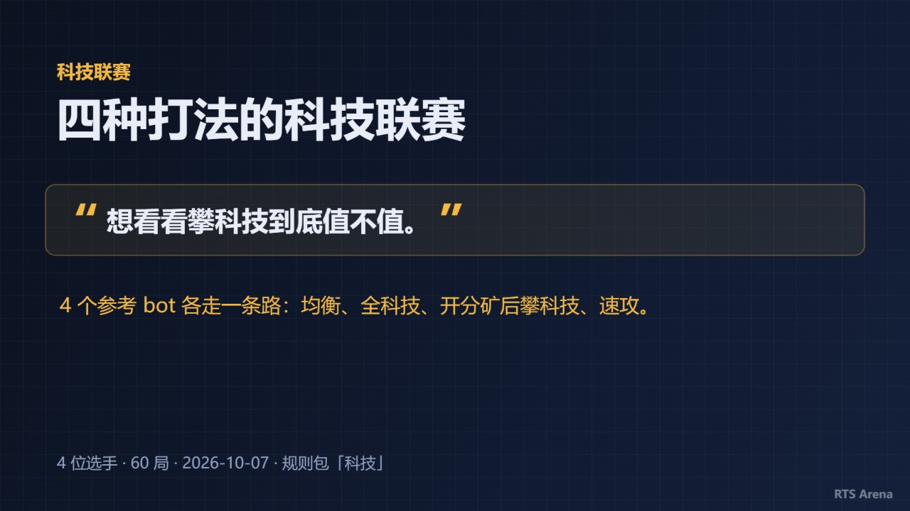
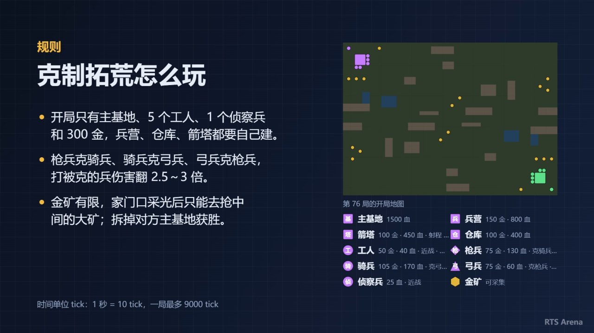
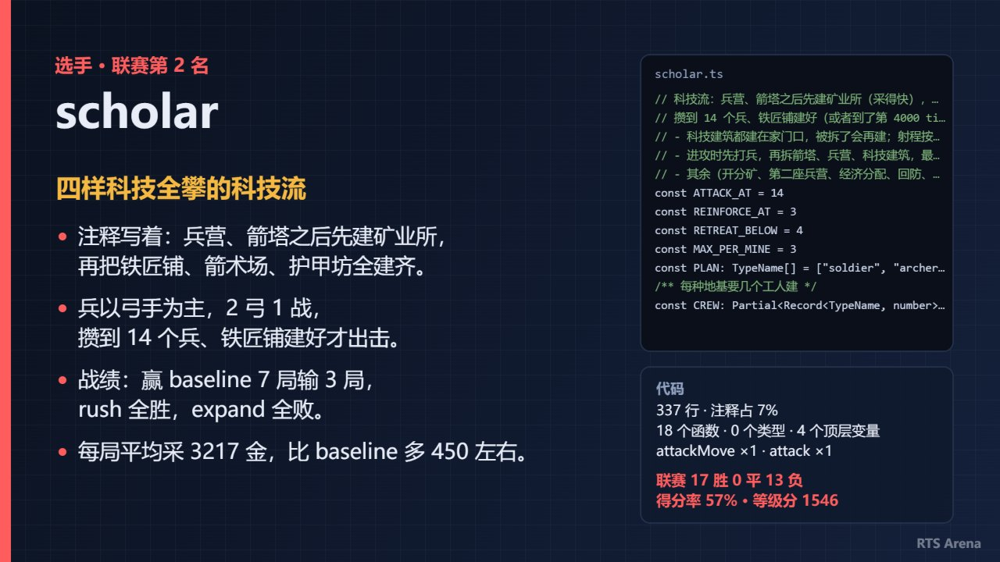
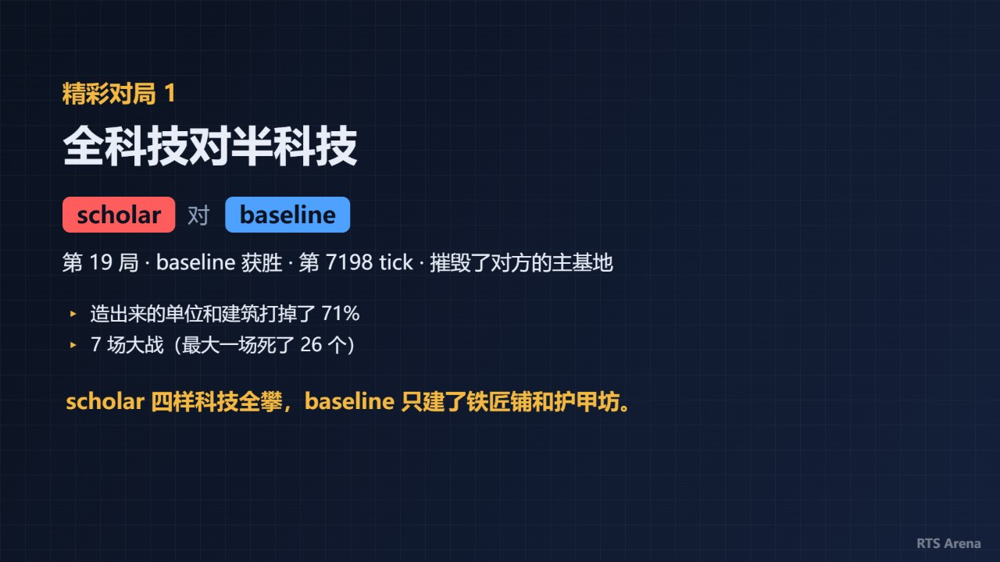

# 联赛视频指南

一场联赛打完，可以做成一段 1920×1080 的视频，发到视频网站或者群里：开头是标题和你想说的一句话，接着讲规则、介绍每个选手、给出排名，最后放几局精彩对局的回放。

分工是这样的：**平台**负责素材、排版、动画和渲染，**你（或者大模型）**只写一份脚本 `script.json`：标题、规则介绍、每个选手的介绍、挑哪几局、每局一句解说。没有配音，渲染用本机的 Chrome 或 Edge，不用装 ffmpeg。

这篇讲视频长什么样、从联赛到成片的每一步、脚本怎么写好，以及怎么交给 agent 一句话做完。还没跑过联赛的话，先看 [入门教程](入门教程.md)。

## 视频长什么样

按顺序是下面这些段。每段多长由平台按字数算，不用自己掐时间：

| 段落 | 时长 | 内容 | 脚本里写什么 |
|---|---|---|---|
| 片头 | 2.7 秒 | 平台署名和仓库地址 | 不用写，也去不掉 |
| 标题页 | 5～12 秒 | 标题、框起来的用户原话、一句解读 | `title`、`userText`、`theme` |
| 规则介绍 | 最长 12 秒 | 左边几句规则，右边开局地图和单位图例 | `rules` |
| 选手页 | 每人 4.6～7 秒 | 左边名字和介绍，右边代码开头、代码指标、战绩 | `players` |
| 联赛排名 | 约 6 秒 | 排行榜 | 不用写 |
| 精彩对局 | 每局两段 | 标题卡（4.5～8 秒）和整局回放（十几到二十秒） | `highlights` |
| 片尾 | 5 秒 | 一句总结、平台署名、选手名单 | `outro` |

4 个选手、3 局精彩对局，成片大约 2 分钟。

**标题页**：最上面一行小字是「<规则包>联赛」，下面是标题、框起来的原话和一句解读。



**规则介绍**：给没玩过的观众讲怎么赢、关键机制。右边的地图取自第一局精彩对局的开局，图例列出每种单位的样子、造价、生命、近战还是远程，都是自动的。



**选手页**：左边是你写的显示名、一行小字、一句话定位和 3～4 句介绍；右边是代码文件开头的 12 行、代码指标（行数、注释比例、函数个数……）和联赛战绩，都是自动的。



**精彩对局的标题卡**：标题、对阵双方、结果，下面的小三角是平台自动列的看点（全联赛最快、逆转、大战……），最后一行黄字是你写的解说。



**精彩对局的回放**：整局压缩播放，打起来的时候慢放、没动静的时候快进。右边侧栏是双方实时的兵数、工人数、建筑数、分数，规则包的状态（比分、科技这类），和「战况」（第一次交火、规则包的事件、大战的伤亡）。


## 准备

- **Chrome 或 Edge**：装在默认位置就能自动找到。装在别处时用环境变量 `RTS_ARENA_BROWSER` 或者 `--browser <路径>` 指定。
- **一场打完的联赛**：下一节第 1 步讲怎么跑。
- **选手的 bot 文件**：别人发来的是压缩包时，Windows 上用系统自带的 `C:\Windows\System32\tar.exe -xf 包.rar` 解压。Git Bash 里的 tar 解不了 RAR；包名是中文时，先复制成英文名再解。

## 从联赛到成片

### 第 1 步：跑联赛

把选手文件放在当前目录，跑一场联赛（规则包的名字用 `rts-arena list` 查）：

```bash
rts-arena league beacons 选手A.ts 选手B.ts 选手C.ts --per-pair 20 --out league
```

选手在视频里的名字就是文件名去掉 `.ts`，取个好认的文件名。

每对打 10～20 局：局数多了才挑得出爆冷、逆转、险胜。一局一般一两秒，3 个选手每对 20 局（共 60 局）一两分钟就够，规则包的对局长就更久。

### 第 2 步：导出视频目录

```bash
rts-arena video-init league my-video --text "要展示给观众的那句话"
```

第一个参数是联赛（汇总文件 `*.series.json`，或者它所在的目录），第二个是要建的目录。只写一个还不存在的名字时，它就是要建的目录，联赛自动找最新的一场。

两个选项分清楚：

- `--text`：标题页上框起来给观众看的原话。只放要说给观众听的那几句。
- `--about`：观众看不到、但写介绍用得上的背景，比如「GLM 写的那个外号叫小 Z」「GPT 上一场是冠军」。会单独列在 PROMPT.md 里。**只写真的知道的事**。

建好的目录里有：

| 文件 | 是什么 |
|---|---|
| `PROMPT.md` | 给写脚本的人（或大模型）的完整说明：视频结构、怎么写、字数上限、脚本格式，以及这场联赛的全部数据：排名、每个选手的代码指标、联赛速查（最快、最久、爆冷、逆转、比分最接近的局……）、精彩对局、全部对局 |
| `RULES.md` | 规则包的规则说明，写规则介绍用 |
| `bots/` | 每个选手代码的副本 |
| `reports/` | 几局的战报：精彩对局、每个选手赢得最快的一局、最长的一局 |
| `script.json` | 待填的脚本（给了 `--text` 的话原话已经填好） |
| `brief.json` | 同样的数据，JSON 格式，给程序用 |

目录里已经有 `script.json` 时命令会拒绝，免得覆盖写好的脚本。

### 第 3 步：写 script.json

自己写，或者让大模型读 `PROMPT.md` 写（PROMPT.md 就是为这个准备的，交给大模型时说一句「读 my-video/PROMPT.md，写好 script.json」就行）。格式：

```json
{
  "title": "四种打法的科技联赛",
  "userText": "想看看攀科技到底值不值。",
  "theme": "4 个参考 bot 各走一条路：均衡、全科技、开分矿后攀科技、速攻。",
  "rules": [
    "开局只有主基地和工人，工人自己建兵营、箭塔、仓库。",
    "还能建 4 种科技建筑，建好后兵变强，被拆了加成就没了。",
    "摧毁对方主基地获胜。"
  ],
  "players": [
    {
      "name": "scholar",
      "displayName": "scholar",
      "tagline": "四样科技全攀的科技流",
      "intro": [
        "注释写着：兵营、箭塔之后先建矿业所，再把铁匠铺、箭术场、护甲坊全建齐。",
        "兵以弓手为主，2 弓 1 战，攒到 14 个兵、铁匠铺建好才出击。",
        "战绩：赢 baseline 7 局输 3 局，rush 全胜，expand 全败。",
        "每局平均采 3217 金，比 baseline 多 450 左右。"
      ]
    }
  ],
  "highlights": [
    { "index": 19, "title": "全科技对半科技", "commentary": "scholar 四样科技全攀，baseline 只建了铁匠铺和护甲坊。" }
  ],
  "outro": "攀科技要先有钱，开分矿的才攀得起。"
}
```

（上面几张图就出自这份脚本。这里只列了一个选手，真写时每个选手都要有。）

| 字段 | 上限 | 说明 |
|---|---|---|
| `title` | 24 字 | 视频标题，不写就是「<规则包>联赛」 |
| `userText` | 120 字 | 用户原话，原样照填 |
| `theme` | 60 字 | 对原话的解读，一句话点出视频要讲什么 |
| `rules` | 1～4 句，每句 45 字，合计 130 字 | 规则介绍，不写就用规则包的一句话简介 |
| `players[].name` | | 联赛里的名字（文件名去掉 `.ts`），必须对得上 |
| `players[].displayName` | 28 字 | 显示名，不写就用 `name` |
| `players[].byline` | 40 字 | 名字下的一行小字，也会上片尾名单；不知道就删掉 |
| `players[].tagline` | 30 字 | 一句话定位，醒目的黄字 |
| `players[].intro` | 1～4 句，每句 50 字 | 介绍，逐句出现 |
| `highlights[].index` | 最多 5 局 | 联赛的**局号**（PROMPT.md「全部对局」表的第一列），不是第几个 |
| `highlights[].title` | 24 字 | 这局的标题 |
| `highlights[].commentary` | 80 字 | 一句解说 |
| `outro` | 60 字 | 片尾的一句总结，可以不写 |

字数按字符算：汉字、字母、数字、空格、标点都算 1 个。`players` 的顺序就是出场顺序，`highlights` 的顺序就是播放顺序。`highlights` 不写就用联赛自动挑的前 3 局、不带解说。

### 第 4 步：核对、预览、出视频

在视频目录里运行，不用写参数：

```bash
cd my-video
rts-arena video --lint
rts-arena video --preview auto
rts-arena video --check auto
```

- `--lint`：只核对脚本，几秒钟。列出每个字段的字数和上限、每段从第几秒到第几秒，脚本格式不对时列出所有问题。字数对了再往下。
- `--preview auto`：每段画一张预览图，放在 `preview/` 里，另有一张把所有预览缩小拼在一起的总览图。先看总览，有问题再打开单张。要细看某几秒就写 `--preview 12.5,40`（秒数从时间表里找）。每次出预览会先清掉上一次的图。
- `--check auto`：出视频（默认叫 `<规则包>联赛.mp4`，`--out` 可以改），再从成品里每段截一张图放进 `preview/`，确认成品和预览一样。两分钟的视频，一般电脑上渲染一两分钟。

`--lint` 的输出大概是这样：

```text
提醒：players[1]（baseline）的 tagline 加 intro 只有 18 字，选手页显得空：写到 3～4 句、120～170 字（对照代码和战绩再写几句）
字数（现在 / 上限，标点和空格也算）：
  title：9 / 24
  ...
  players[0]（scholar）tagline 加 intro：152 / 170
每段的时间（整段 79.8 秒）：
    0.0～2.7   秒  片头署名
    2.7～9.9   秒  标题、用户原话和解读
    9.9～19.6  秒  规则介绍
   19.6～26.5  秒  选手 scholar
   ...
   74.8～79.8  秒  总结、片尾署名和选手名单
```

「提醒」不挡出视频，但最好照着改。改完脚本重跑 `--check auto` 就是新的成片。

## 脚本怎么写好

**原话和解读**。先弄懂用户的原话在说什么：调侃谁、有什么梗、站在哪边，在 `theme` 里一句话点出来，整个视频的语气跟着它走。原话里夹着给写脚本的人的要求（比如「请把某某叫作某某」）时，照做，但这句要求不放进 `userText`。

**规则介绍写给没玩过的人**。照 `RULES.md` 讲怎么赢、开局有什么、最关键的机制。别写「和某某规则包一样」「在某某的基础上」：观众不一定玩过那个规则包，要用到的规则直接简要讲出来（写了命令会提醒）。造价、生命这些数值图例里有，不用重复。

**名字和小字**。文件名常见写法是 `模型名-编程工具.ts`，据此写 `displayName`（模型名，加空格好读）和 `byline`（编程工具）。`byline` 会出现在片尾的正式名单里，只写正经信息，玩笑放进 `tagline` 和介绍。文件名只是外号、看不出是哪个模型时，就照原样用，**别猜模型名**；不知道作者和编程工具就删掉 `byline`。

**选手介绍要有依据**。`tagline` 加 `intro` 一共 120～170 字、3～4 句最合适：少于 100 字页面显得空，超过 170 字读不完。内容从这几处来：

- 代码：读一遍 `bots/` 里的代码（至少开头的注释和主要的决策逻辑），写出这是什么样的打法：先攒兵还是速攻、靠调参还是靠架构。
- 代码指标和战绩：PROMPT.md 里有，数字照抄。
- 战报：`reports/` 里有几局的详细过程。

**注释可能是自称**。文件开头的注释是作者写的，可能是旧版本，也可能是自吹（注释说「一个工人都不补」，参数却补到 5 个）。写打法以代码里的参数和战报为准，注释里的话只能说「自称」「注释里写着」。成绩差的选手写它的特点和输在哪，可以跟着原话调侃，但别贬低。

**挑 3～5 局排成故事线**。先看 PROMPT.md 的「联赛速查」：最快、最久、爆冷、逆转、比分最接近、死人最多的局都算好了。按想讲的故事排顺序，比如「先看冠军的统治力，再看它唯一输的那局」。

**解说别重复自动看点**。标题卡上的小三角是平台自动列的（PROMPT.md「全部对局」表里每局的「标题卡看点」），解说讲看点没讲的：这局的来龙去脉、关键的一下、和选手风格的关系。解说里说的事要在战报里查得到；没附战报的局用 `rts-arena report <回放文件>` 看。

**粗体字段别写「一」**。`title`、`tagline`、精彩对局的 `title` 和 `commentary`、`outro` 是粗体，「一」在粗体下就是一道横线，像破折号（「只输一局」看成「只输—局」）。数量写阿拉伯数字（「只输 1 局」），别的换个说法（「一波」写成「突袭」）。写了命令会提醒。

## 交给 agent 做

仓库里有一份给 Claude Code 这类 agent 用的技能：[skills/league-video/SKILL.md](../skills/league-video/SKILL.md)。把整个 `league-video` 目录复制到 `~/.claude/skills/`（所有项目都能用）或者项目的 `.claude/skills/` 下，然后跟 agent 说：

> 给这场联赛出个视频，开头放这句话：「……」

它会照上面的流程走：没有联赛就先跑一场、导出视频目录、读代码和战报写脚本、核对、看预览、出视频，最后告诉你视频在哪、挑了哪几局、为什么。

给 agent 的话里，要展示给观众的原话和给它的要求分开说，背景（外号对应哪个模型、以前的成绩）也一起告诉它，它会放进 `--about`。看完预览不满意，直接说哪里不好（「介绍太短」「第二局换成爆冷那局」），它改脚本重出。

## 常见问题

| 现象 | 原因和办法 |
|---|---|
| 找不到浏览器 | Chrome / Edge 不在默认位置：设环境变量 `RTS_ARENA_BROWSER`，或者加 `--browser <路径>` |
| 这个浏览器不支持 WebCodecs | 浏览器太旧，升级 Chrome / Edge |
| 没找到联赛的汇总文件 | 不在视频目录里运行：先 `cd` 进 `video-init` 建的目录，或者把联赛汇总写在命令里 |
| 选手页右边显示「（没找到代码文件）」 | 联赛记的 bot 路径是相对跑联赛时的目录，渲染时找不到。把选手代码放进视频目录的 `bots/`（文件名不变）就行 |
| `video-init` 说已经有 script.json | 换个目录名；或者确认不要了再删掉那个目录里的 script.json |
| 选手页太空或读不完 | `tagline` 加 `intro` 写到 120～170 字，`--lint` 会列出每人的字数 |
| 标题里出现一道横线 | 粗体字段里写了「一」，换成数字或别的说法 |
| 想去掉片头片尾的署名 | 去不掉，这是平台固定加的 |
| 想要配音或背景音乐 | 平台不做，成片导进剪辑软件再加 |
| 回放太快看不清 | 回放会把整局压缩到十几二十秒，打起来时自动慢放。想让观众看清某局，就在解说里点出关键的一下，或者让观众用 `rts-arena view` 看完整回放 |
| 改了一个字想重出 | 改 `script.json`，重跑 `rts-arena video --check auto`，整段重新渲染 |

## 接下来

- 想让选手更强、视频更好看：见 [写 bot 指南](写-bot-指南.md)。
- 想换个玩法办联赛：见 [规则包介绍](规则包介绍.md)。
- 想自己设计玩法，并让回放和视频好看（地图标记、比分、战况事件）：见 [规则包编写指南](规则包编写指南.md)。
